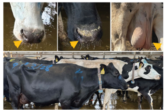

***

We investigated the impact of influenza A-H5N1 virus infection in a dairy herd. Clinical disease, which lasted for about three weeks, was recorded in 20.0% (777/3,876) of the adult cows. Pronounced milk losses of ~900 kg per cow were recorded in affected cows during a 60 day-post-outbreak period. Seroprevalence was 89.4% (570/637) in the herd, with 76.1% (485/637) of the seropositive animals being subclinically infected. Clinically affected cows presented an increased risk of death (6 times) and of premature herd removal (3.6 times), when compared to non-clinical cows. Economic losses due to decreased milk production, mortality and early herd removal were estimated at 950 US dollars per clinically affected cow for a total cost of approximately 737,500 US dollars for the herd during the observation period. Our results demonstrate a long-lasting production impact and significant financial consequences of HPAI H5N1 virus infection to dairy farms.

 

